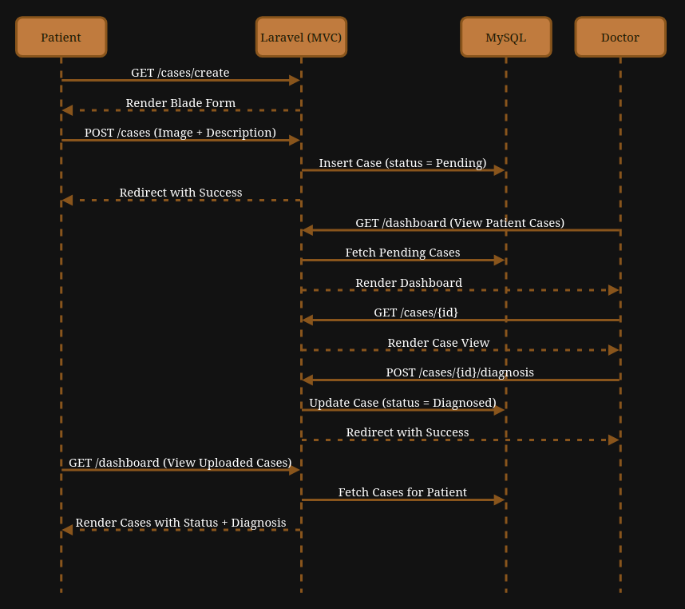

# Pediatric Teledermatology Platform

A minimal web application for remote pediatric dermatology consultations.

---

## Tech Stack
- **Backend:** Laravel
- **Frontend:** React + Tailwind CSS (Vite)
- **Database:** MySQL

---

## System Overview

## Medical Consultation Sequence Diagram

---

## Features Planned (MVP)

- Authentication & RBAC (Doctor/Patient/Admin)

- Patients/Parents:
    - Upload case images + descriptions (and other relevant info) for consultation.
    - View status of their uploaded cases and the diagnosis and treatment plans uploaded by doctor.

- Doctors:
    - View all cases uploaded by patients (no assignment system for the MVP).
    - Add diagnosis and treatment plans to cases.

- Admins:
    - View all submitted cases.
    - View status and details of cases.
    - More privileges, like removing users, etc. (not decided yet; will finalise soon).

---
