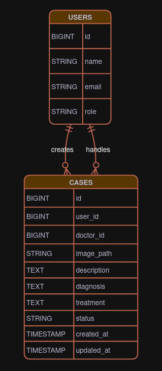

# TeleDermPeds

A web application for remote dermatology consultations for children.

---

## Tech Stack
- **Backend:** Laravel (MVC)
- **Frontend:** Blade + Tailwind CSS
- **Database:** MySQL

---

## System Overview

## Medical Consultation Sequence Diagram

> [!NOTE]  
> This sequence diagram illustrates the core medical consultation workflow between Patient and Doctor. Admin actions are excluded from the diagram as they are not part of the primary consultation flow.

## ER Diagram

---

## Features Planned (MVP)

- Authentication & RBAC (Doctor/Patient/Admin)

- Patients/Parents:
    - Upload case images + descriptions (and other relevant info) for consultation.
    - View status of their uploaded cases and the diagnosis and treatment plans provided by the doctor.

- Doctors:
    - View all cases uploaded by patients (no assignment system for the MVP).
    - Add diagnosis and treatment plans to cases.

- Admins:
    - View all users.
    - Delete users.
    - View all submitted cases (read-only).

---
