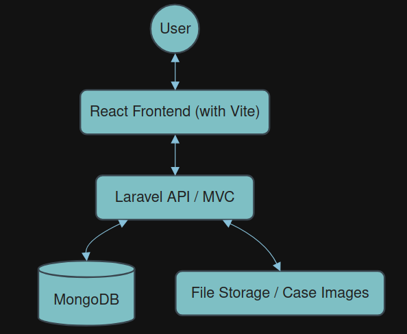
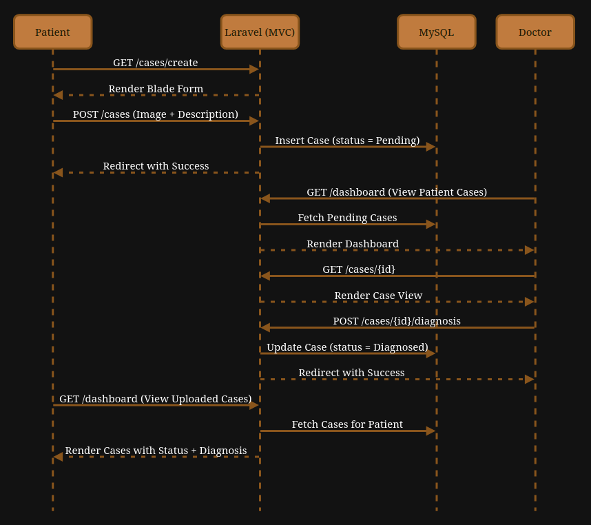
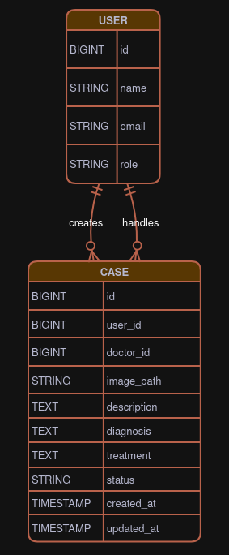

# TeleDermPeds

A web application for remote dermatology consultations for children.

---

## Tech Stack
- **Backend:** Laravel
- **Frontend:** Blade + Tailwind CSS
- **Database:** MySQL

---

## System Overview


## Medical Consultation Sequence Diagram


> [!NOTE]  
> This sequence diagram illustrates the core medical consultation workflow between Patient and Doctor. Admin actions are excluded from the diagram as they are not part of the primary consultation flow.

## ER Diagram


---

## Features Planned (MVP)

- Authentication & RBAC (Doctor/Patient/Admin)

- Patients/Parents:
    - Upload case images + descriptions (and other relevant info) for consultation.
    - View status of their uploaded cases and the diagnosis and treatment plans provided by the doctor.

- Doctors:
    - View all cases uploaded by patients (no assignment system for the MVP).
    - Add diagnosis and treatment plans to cases.

- Admins:
    - View all users.
    - Delete users.
    - View all submitted cases (read-only).

---

## Setup & Development

> This section exists because this is a team project.

### 1. Installation
```bash
composer install
npm install
```

### 2. Database & Seeding
Initialize the database with default accounts for testing:
```bash
php artisan migrate:fresh --seed
```

**Default Test Accounts:**
- **Admin**: `admin@telederm.com` / `AdminPass123!`
- **Doctor**: `doctor@telederm.com` / `DoctorPass123!`
- **Patient**: `patient@telederm.com` / `PatientPass123!`

### 3. File Storage
Run this command to make uploaded medical images visible:
```bash
php artisan storage:link
```

### 4. Running the App
Run both commands in separate terminals:
```bash
php artisan serve
npm run dev
```

---
